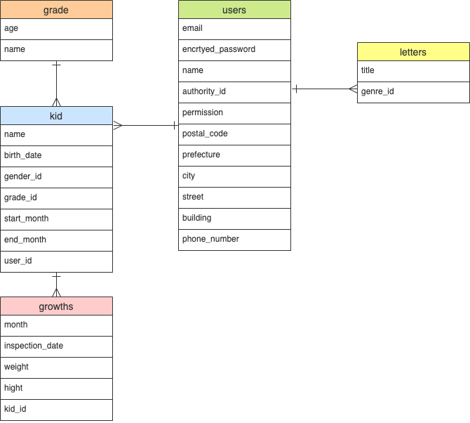
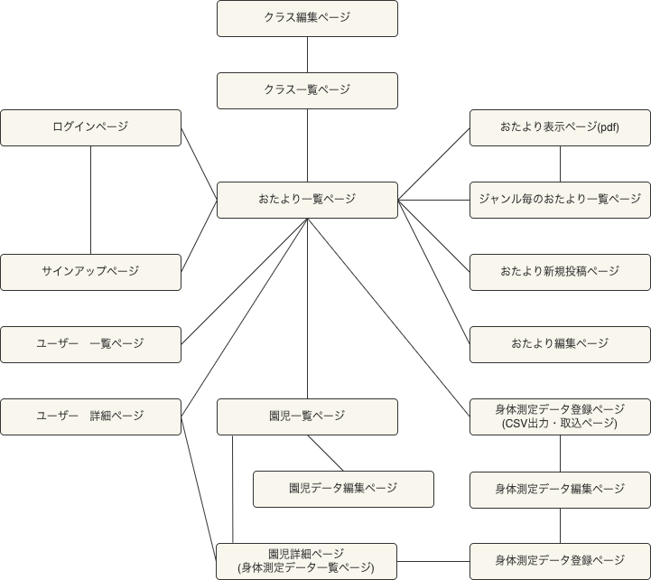

# アプリケーション名	
### Tsumiki-note

# アプリケーション概要
保育士と保護者をつなぎ、子供の成長を共に喜び合える時間を創出する。

# URL
https://tsumiki-note.herokuapp.com/

# テスト用アカウント
## Basic認証
ID: TsumikiUser 
Password: 0404

## ログイン
### 保育士アカウント
E-mail: test1@test.com 
Password: 000000y

### 保護者アカウント
E-mail: test4@test.com 
Password: 000000y

# 利用方法
## おたより投稿
1. 保育士アカウントでログインし、保育園メニューのおたより登録に遷移する。
2. pdfファイル形式のおたよりを投稿する。
3. 投稿したおたよりは、保護者アカウントでも閲覧可能。また、保育士権限を持つアカウントで編集・削除が可能。

## 成長管理
1. 保育士アカウントで、保育園メニューの身体測定データ登録に遷移する。
2. 身体測定データ取込用ファイルの出力をクリックして、CSVファイルを抽出。
3. 園児の身長・体重のデータをCSVファイルに入力して、同ページからインポートすることで、一括で保存が可能。 
また、各園児のページからも個別で身体測定データの登録が可能。

# アプリケーションを作成した背景
息子の通う保育園では、おたよりや身体測定の結果は、紙面を連絡帳に挟む形式で行われている。
その場合、おたより類の挟むための作業や保管に、保育士や保護者の手が掛かってしまう。
また、必要な書類を探すのにも時間が掛かる。
子供を見ながらそういった作業を行う時間を極力減らすことで、保育の時間や家庭での時間をより充実したものにして欲しいという願いを込めている。

## 想定ペルソナ
### 保育士
長年、保育を専門に行なってきたので、保育には自信がある。 
ITにはあまり詳しくないが、おたより作成や身長・体重の管理は他のシステムを利用しているので、なるべく簡単に連携したい。

### 保護者
30代の保護者。イヤイヤ期真っ盛りの2歳の息子がいる。 
夕飯の献立を考えるために、保育園の献立表を確認することがよくある。 
共働きで働いているので、少しでも子供と一緒に過ごしたい。

# 洗い出した要件
https://docs.google.com/spreadsheets/d/1utKkaMtELSqeDT9rEE0uR7SxQaUkpoAo/edit?usp=sharing&ouid=103784417175188076029&rtpof=true&sd=true

# 実装した機能についての画像やGIFおよびその説明
おたよりをクリックすることで、投稿したpdfが表示可能。

 身体測定のデータは取込用CSVファイルを利用して、インポート可能に。

 保育士権限と保護者権限を準備。保護者権限での閲覧に制限をかけることで、プライバシーに配慮。

# 実装予定の機能
## スマートフォンアプリの開発
保護者ペルソナは、PCよりスマートフォンを利用することを想定し、Androidアプリの開発を検討中。現在、開発に向けた学習を行なっている。

## 機能の拡張
下記の機能拡張を検討中。
1. 保育士と保護者の日々の連絡を取り合うための連絡帳機能
2. 保育料の支払い機能の実装
3. 保護者による身体測定データの登録
4. ユーザーの編集機能や、許可できないユーザーの削除機能

## フロントのモダン化
見た目は使いやすさに直結する。より使いやすく見やすいビューとなるように整えたい。主に下記の点を検討している。
1. スマートフォンで見れるようにレスポンシブ化。
2. 各種データのソート機能。
3. 身体測定データのグラフ化。

# データベース設計

# 画面遷移図

# 開発環境
## フロントエンド
HTML, CSS, JavaScript, PostcodeJP API

## バックエンド
Ruby, Ruby on Rails

## データベース
MySQL, SequelPro

## Webサーバ(本番環境)
HEROKU

## ソース管理
GitHub, GitHubDesktop

## テスト
RSpec

## エディタ
VSCode

# ローカルでの動作方法
$ git clone https://github.com/moe20200404/tsumiki-note 
$ cd tsumiki-note 
$ bundle install 
$ rails db:create 
$ rails db:migrate 
$ rails s 

# 工夫したポイント
このアプリは、保育士と保護者の時間短縮を最大の目的としている。
そのために極力入力やクリックが少なくなるように下記の工夫を行なった。
1. 身体測定データの一括取込
身体測定データは、他のソフトウェアなどでも管理している。
連携しやすいようにCSVでの取込ができるように工夫した。
2. 画面遷移の容易さ
ルートページにジャンル毎の最新おたよりを設定することで、
スムーズにおたよりを閲覧できる。
３. 新規ユーザー登録時の住所検索
PostcodeJP APIを導入することで、住所の入力の手間を省き、間違い防止に努めた。
4. 保育士メニューの表示
保育士の行う機能を1箇所に固めることで、素早く作業が行えるようにした。
また、許可のないユーザーがいる場合、すぐに気づくことがきるよう保育士メニューに無許可ユーザーの表示を設定した。
